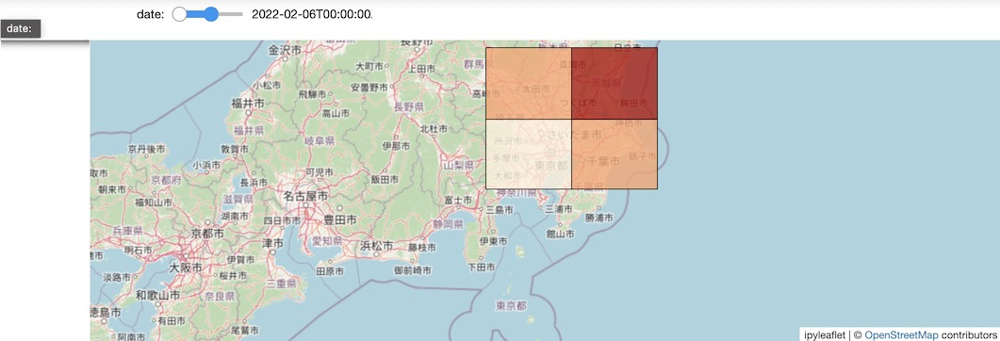
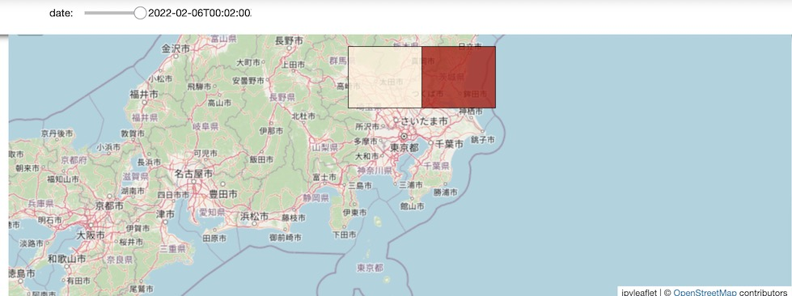

# visualize-mesh-timelapse
地理空間データを、ipyleafletを使って可視化＋期間でフィルタするサンプルスクリプト



## example(input)
`mesh_timeseries.csv`がサンプルの入力データです。

- id: ジオメトリID
- record_utc_date: データの記録日時(UTC, ISO8601フォーマット)
- value: データ値
- polygon_geometry: ジオメトリ情報(ポリゴン、json.loadsで読み出すとそのままgeojsonのPolygonに渡せる形式)

## installation

必要なライブラリは以下の通りです。Python3.9.9上で動作検証しています。

| ライブラリ名     | 役割                          | 検証に使ったバージョン | 備考                                                     |
|------------|-----------------------------|-------------|--------------------------------------------------------|
| geojson    | 地理空間データをgeojson形式に変換する      | 2.5.0       |                                                        |
| pandas     | 地理空間データの加工、フィルタリング          | 1.4.2       |                                                        |
| ipyleaflet | 地理空間データを地図上に可視化する           | 0.16.0      | ※ ipywidgets, jupyter-notebookはipyleafletとともにインストールされる |
| branca     | ipyleafletで使うカラーマップ定義が入っている | 0.4.2       |                                                        |

pipenvをご利用の場合、以下コマンドでインストールできます。

```bash
pipenv install
```

## usage

```bash
pipenv shell
jupyter-notebook
```

jupyter-notebook上で一通りスクリプトを実行すると、マップ上でデータを可視化できます。




